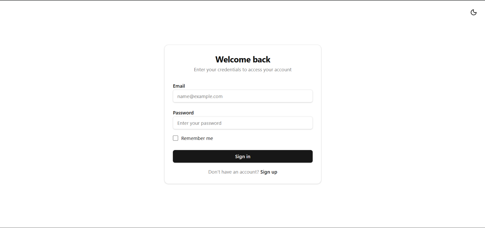
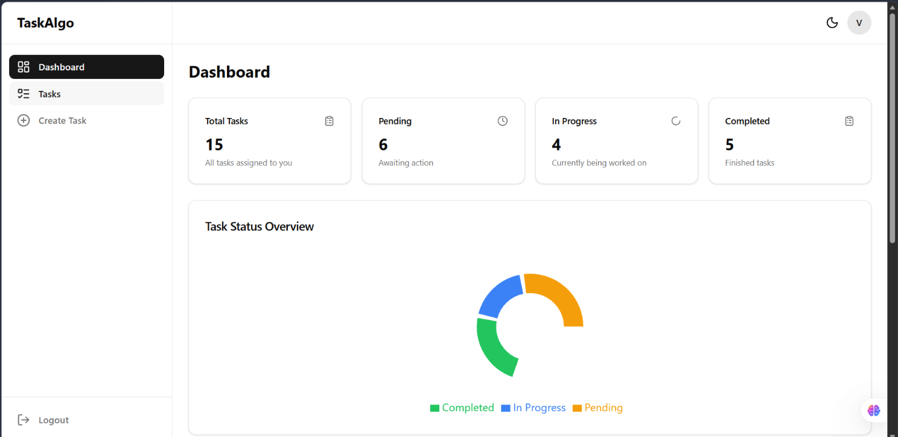
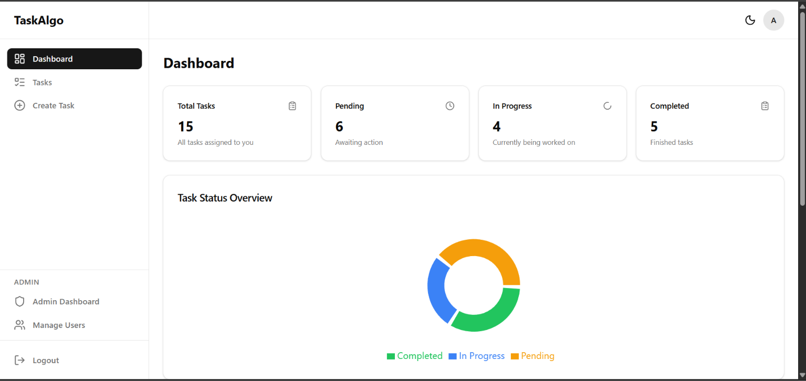
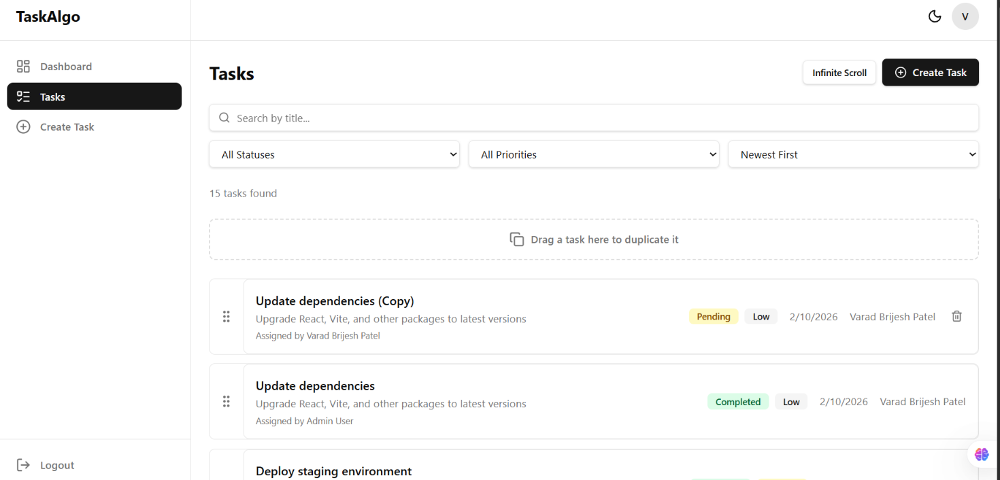
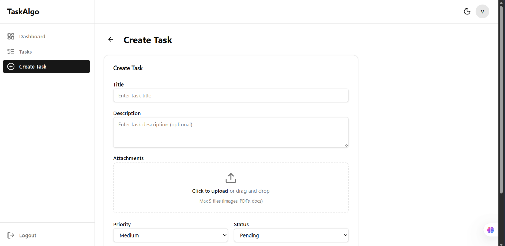
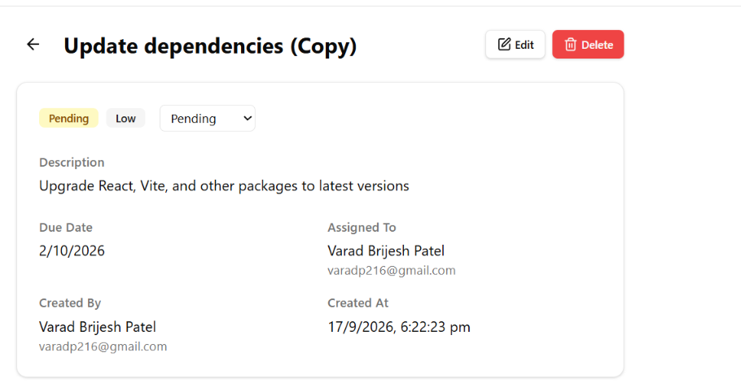

# Task & Team Management Platform

A full-stack task and team management platform built with React, Node.js, Express, and MongoDB Atlas.

## Live URLs

- **Frontend**: https://task-and-team.vercel.app
- **Backend API**: https://task-and-team-management-platform.onrender.com

## Screenshots

### Login Page


### User Dashboard


### Admin Dashboard


### Tasks Page


### Create Task


### Task Detail


## Tech Stack

### Frontend
- React 19 + TypeScript
- Vite 8 (build tool)
- React Router v7 (routing)
- Redux Toolkit + RTK Query (state management + API caching)
- Axios (HTTP client for auth endpoints)
- Tailwind CSS v4 (styling)
- React Hook Form + Zod (form validation)
- Recharts (charts)
- @dnd-kit (drag and drop)
- Lucide React (icons)

### Backend
- Node.js + Express 4
- Mongoose 8 (MongoDB ODM)
- JSON Web Tokens (authentication)
- bcryptjs (password hashing)
- express-validator (input validation)
- Multer + Cloudinary (file uploads)

### Database
- MongoDB Atlas (cloud database)

### Deployment
- Frontend → Vercel
- Backend → Render
- Database → MongoDB Atlas

## Setup Instructions

### Prerequisites
- Node.js 18+ installed
- MongoDB Atlas account (or local MongoDB)
- Cloudinary account (for file uploads)

### Backend Setup

```bash
cd server
npm install
```

Create a `.env` file in the `server/` directory:

```env
PORT=5000
MONGO_URI=your_mongodb_atlas_connection_string
JWT_SECRET=your_strong_random_secret_min_32_chars
JWT_EXPIRE=30d
CLIENT_URL=http://localhost:5173
CLOUDINARY_CLOUD_NAME=your_cloud_name
CLOUDINARY_API_KEY=your_api_key
CLOUDINARY_API_SECRET=your_api_secret
```

Start the server:

```bash
npm run dev
```

### Frontend Setup

```bash
cd client
npm install
```

Create a `.env` file in the `client/` directory:

```env
VITE_API_URL=http://localhost:5000/api
```

Start the development server:

```bash
npm run dev
```

The frontend will be available at `http://localhost:5173`.

## Test Accounts

| Email | Password | Role |
|-------|----------|------|
| testuser@example.com | Test@1234 | user |
| admin@example.com | Admin@1234 | admin |
| varadp216@gmail.com | (contact admin) | user |

## API Documentation

### Authentication

| Method | Endpoint | Description | Auth Required |
|--------|----------|-------------|---------------|
| POST | `/api/auth/register` | Register a new user | No |
| POST | `/api/auth/login` | Login and get JWT token | No |
| GET | `/api/auth/me` | Get current user profile | Yes |

### Tasks

| Method | Endpoint | Description | Auth Required |
|--------|----------|-------------|---------------|
| GET | `/api/tasks` | List tasks (with search, filter, sort, pagination) | Yes |
| GET | `/api/tasks/:id` | Get single task | Yes |
| POST | `/api/tasks` | Create a new task | Yes |
| PUT | `/api/tasks/:id` | Update a task | Yes |
| DELETE | `/api/tasks/:id` | Delete a task | Yes |
| POST | `/api/tasks/:id/duplicate` | Duplicate a task | Yes |

### Users

| Method | Endpoint | Description | Auth Required |
|--------|----------|-------------|---------------|
| GET | `/api/users` | List all users | Yes (admin) |

### Admin

| Method | Endpoint | Description | Auth Required |
|--------|----------|-------------|---------------|
| GET | `/api/admin/stats` | Get dashboard statistics | Yes (admin) |
| GET | `/api/admin/users` | List all users with pagination | Yes (admin) |
| GET | `/api/admin/tasks` | List all tasks with pagination | Yes (admin) |

### File Upload

| Method | Endpoint | Description | Auth Required |
|--------|----------|-------------|---------------|
| POST | `/api/upload` | Upload a file (image/PDF/doc) to Cloudinary | Yes |

### Health Check

| Method | Endpoint | Description | Auth Required |
|--------|----------|-------------|---------------|
| GET | `/api/health` | Server health check | No |

### Query Parameters (GET /api/tasks)

| Parameter | Type | Description |
|-----------|------|-------------|
| page | number | Page number (default: 1) |
| limit | number | Items per page (1-50, default: 10) |
| search | string | Search by task title (case-insensitive) |
| status | string | Filter by status: pending, in-progress, completed |
| priority | string | Filter by priority: low, medium, high |
| sort | string | Sort field: createdAt, dueDate, priority (prefix with - for descending) |

### Example API Requests

**Register:**
```json
POST /api/auth/register
{
  "name": "John Doe",
  "email": "john@example.com",
  "password": "Password123"
}
```

**Login:**
```json
POST /api/auth/login
{
  "email": "john@example.com",
  "password": "Password123",
  "rememberMe": true
}
```

**Create Task:**
```json
POST /api/tasks
Authorization: Bearer <token>
{
  "title": "Complete project documentation",
  "description": "Write comprehensive README and API docs",
  "priority": "high",
  "dueDate": "2026-09-25",
  "status": "pending",
  "assignedTo": "<user_id>"
}
```

## Folder Structure

```
Task-Algo/
├── client/                    # React frontend
│   ├── public/               # Static assets
│   ├── src/
│   │   ├── assets/           # Images, logos
│   │   ├── components/
│   │   │   ├── auth/         # Route guards (ProtectedRoute, PublicRoute, AdminRoute)
│   │   │   ├── charts/       # StatusChart, PriorityChart
│   │   │   ├── dashboard/    # StatCard, EmptyState, DashboardSkeleton
│   │   │   ├── layout/       # Header, Sidebar, DashboardLayout, ThemeToggle, UserMenu
│   │   │   ├── tasks/        # TaskForm, TaskRow, TaskFilters, Pagination, FileUpload, etc.
│   │   │   └── ui/           # Reusable UI (Button, Input, Card, Badge, Toast, etc.)
│   │   ├── hooks/            # useAuth, useDebounce, usePagination, useToast
│   │   ├── pages/            # Page components (Login, Dashboard, Tasks, etc.)
│   │   ├── services/         # Axios instance (api.ts)
│   │   ├── store/            # Redux store, authSlice, tasksApi, adminApi
│   │   ├── types/            # TypeScript interfaces
│   │   ├── utils/            # validation, constants, errors, cn
│   │   ├── App.tsx           # Routes + lazy loading
│   │   └── main.tsx          # Entry point
│   ├── vercel.json           # Vercel SPA config
│   └── vite.config.ts        # Vite config with proxy
├── server/                    # Express backend
│   ├── config/               # db.js (MongoDB), cloudinary.js
│   ├── controllers/          # authController, taskController, adminController, uploadController
│   ├── middleware/            # auth, adminOnly, validate, errorHandler, upload
│   ├── models/               # User.js, Task.js (Mongoose schemas)
│   ├── routes/               # auth, tasks, users, admin, upload
│   ├── utils/                # generateToken, catchAsync
│   └── server.js             # Express app entry point
└── README.md
```

## Features

### Core Features
- User registration and login with JWT authentication
- Remember Me (localStorage) vs session-only (sessionStorage)
- Role-based access control (user/admin)
- Full CRUD operations for tasks
- Task assignment to users
- Search by task title
- Filter by status and priority
- Sort by date and priority
- Pagination with page numbers
- Dashboard with task statistics and charts

### Bonus Features
- Dark mode with persistent toggle
- Infinite scroll (toggle with pagination)
- Drag and drop task duplication
- File upload (images, PDFs, documents) via Cloudinary
- Toast notifications
- Responsive design (mobile + desktop)

### Authorization Rules
- **Task Creator**: Can edit and delete the task
- **Assigned User**: Can update task status only
- **Admin**: Full access to all tasks and admin dashboard

## License

This project was built as a full-stack intern assignment.
